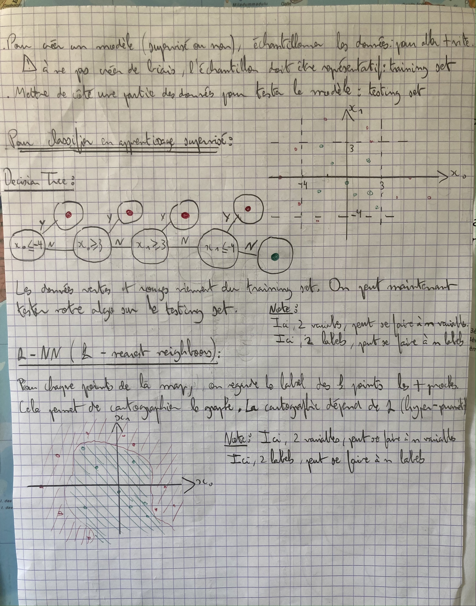
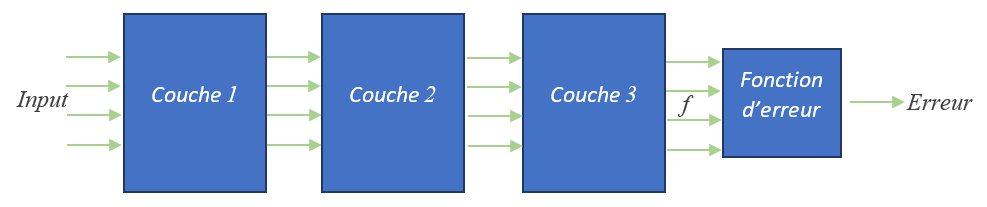
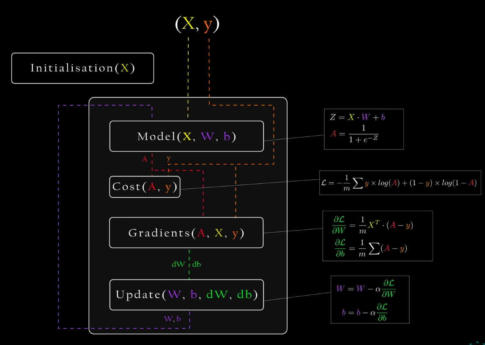
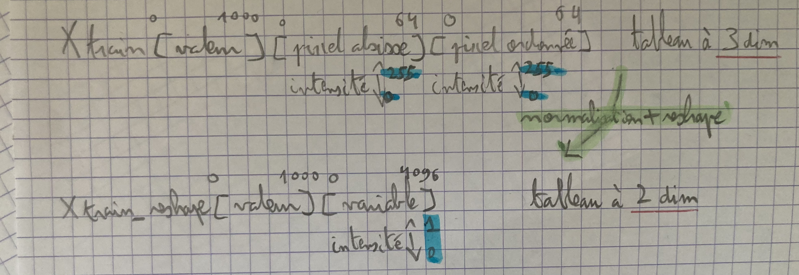
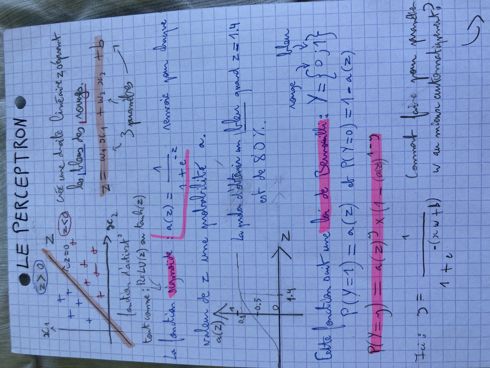
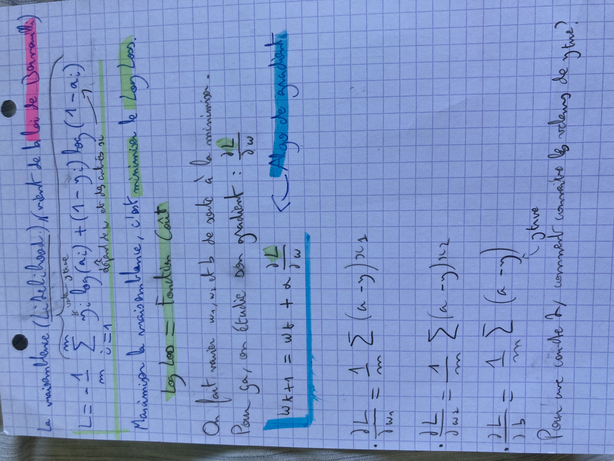
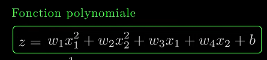
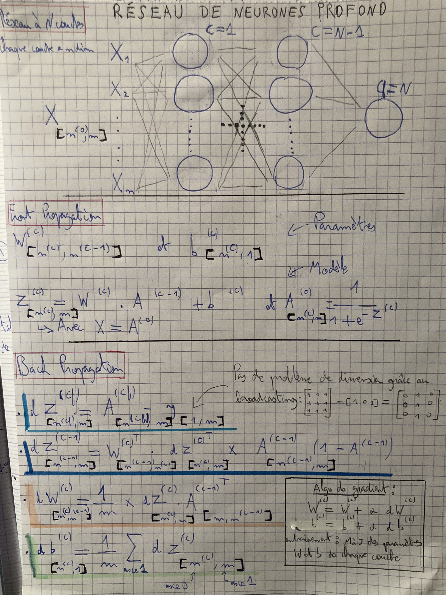

# →Data Science : [lien direct algo ML] Utilisée pour analyser et interpréter les données (Machine Learning)

# Apprentissage automatique non profond :

### Supervisé :

Decision Tree puis K-nn : 



### Non Supervisé :

K-means, clustering : 


# Apprentissage automatique profond :

Utilisation de la bibliothèque Torch du module PyTorch de python pour manipuler les tenseurs (sortes de matrice) : 

```python
import torch
dtype = torch.float
device = torch.device("cpu") # Tous les calculs seront exécutés sur le processeur
# device = torch.device("cuda:0") # Tous les calculs seront exécutés sur la carte graphique

# Création d'un tenseur rempli avec des nombres aléatoires
a = torch.randn(2, 3, device=device, dtype=dtype)
print(a) # Affichage du tenseur a
# Output: tensor([[-1.1884,  0.8498, -1.7129],
#                  [-0.8816,  0.1944,  0.5847]])

# Création d'un tenseur rempli avec des nombres aléatoires
b = torch.randn(2, 3, device=device, dtype=dtype)
print(b) # Affichage du tenseur b
# Output: tensor([[ 0.7178, -0.8453, -1.3403],
#                  [ 1.3262,  1.1512, -1.7070]])

print(a*b) # Affichage du produit (terme à terme) des deux tenseurs
# Output: tensor([[-0.8530, -0.7183,  2.58],
#                  [-1.1692,  0.2238, -0.9981]])

print(a.sum()) # Affichage de la somme de tous les éléments du tenseur a
# Output: tensor(-2.1540)

print(a[1,2]) # Affichage de l'élément de la 2ème rangée et de la 3ème colonne de a
# Output: tensor(0.5847)

print(a.min()) # Affichage de la valeur minimale du tenseur a
# Output: tensor(-1.7129)
```

Avant de se lancer dans les réseaux de neurones, rappel sur l’algo de gradient pour un training set à n dimensions : 

Permet de trouver le minimum (local) d’une fonction à n variables. 

```python

def gradient(X): #fonction à coder, sinon scipy 
	...

def algo_grad(X,p=0.01,Err): #X peut au départ être généré aléatoirement, pas de O.O1 et Err notre fonction à minimiser
	while True : 
		grad = gradient(Err(X))
		X = X - p * grad #Arrivé au minimum, X n'évolue plus : on a trouvé Xmin
		
	
```

Réseau de neurones profond : 



- Input :
    
    Données X du training set
    
- f :
    
    La fonction est la prédiction du réseau de neurone, elle constitue l’ensemble des couches. 
    

### Principe de l’algo du réseau de neurones profonds :

# Front Propagation + Back Propagation :

### 1 seule couche :



La fonction coût est calculée pour afficher l’évolution de l’erreur en fonction des itérations. 

Autres étapes non indiquées sur le schéma ci dessus mais présentes dans le code (lien ci dessous) pour le data cat and dog  : 

- normaliser le train set et le test set : Xnorma = X-Xmin/Xmax-Xmin
- gérer les problème de dimension avec la fonction reshape()



- entrainer le modèle en trouvant les bons hyper-paramètres : learning rate et nb itération (mettre la bar de chargement )
- évaluer le modèle avec le test set

[](https://jupyterhub.ijclab.in2p3.fr/jupyter/user/simon.khan@universite-paris-saclay.fr/notebooks/autre/dl_1neuron.ipynb)

Les fonctions d’activation, coût, et le gradient sont calculées à partir des formules suivantes : 





Avec une seule couche, on peut gérer des problèmes de régression logistique. La régression peut être linéaire (comme dans notre cas), mais parfois aussi polynomiale :



Sauf que ça, c’est du ML. En DL, on rajoute une couche de neurone. 

### N couches :



[](https://jupyterhub.ijclab.in2p3.fr/jupyter/user/simon.khan@universite-paris-saclay.fr/notebooks/autre/dl_Nlayers_nneurons.ipynb)