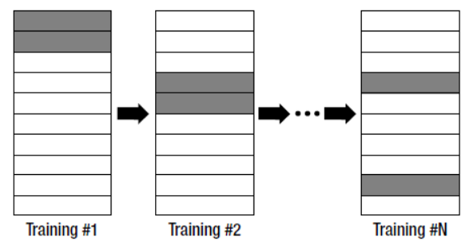
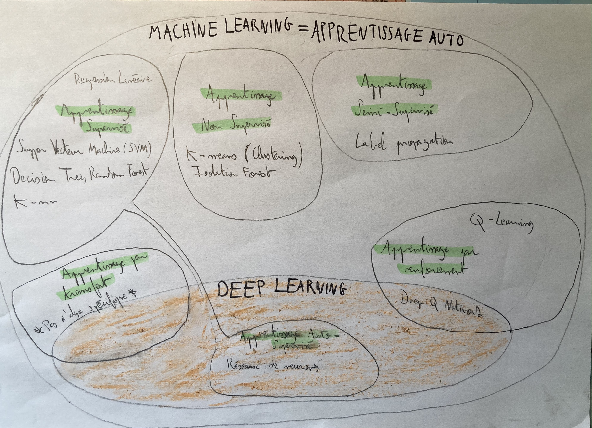

# Créer un modèle statistique pour analyser les données

(Ici on parle de ML, mais ça peut être plus simple : corrélations, moyennes, écarts types etc)

## 2 phases :

## 1 : Apprentissage Automatique = Machine Learning :

Se fait avec des données d’entrainement : training set labellisées ou non : 

- Labellisé :  Permet de classifier les données dans des classes (label) déjà connus : Image de chien ou de chat ? On parle d’apprentissage SUPERVISE
- Non Labellisé : Permet de classifier les données et de découvrir de nouvelles classes, idéal pour découvrir de nouvelles tendances, des points communs insoupçonnés. On parle d’apprentissage NON SUPERVISE

## Les ALGORITHMES D’APPRENTISSAGE AUTO :

Pour trouver l’algo adéquat, toujours se poser 2 questions : 

- Mes données sont labellisées ou non ?
- Ce que je cherche, c’est obtenir une valeur numérique ? (Régression —> Nombre) Ou discrète ? (Classification —> Catégorie)

|  | Supervisé | Non Supervisé | Semi Supervisé | Auto Supervisé | Par renforcement | Par transfert |
| --- | --- | --- | --- | --- | --- | --- |
| Régression (Prix du loyer en fct de la surface de l’appart) | Régression linéaire, Decision Tree |  |  |  |  |  |
| Classification (Chat ou Chien ?) | K-nn, Decision Tree | Clustering (K-means), Isolation Forest | Label Propagation | Neural Network | Q learning, Deep Q Learning |  |

La plupart des algos font Régression ET Classification, mais il est bon de toujours se poser la question de ce que l’on cherche. 

### Estimer l’efficacité d’un ALGO de ML :

Attention à ne pas faire de l’Underfitting : le modèle n’est pas assez entrainé et ne peux donc pas fonctionner avec précision sur les nouvelles données. 

Ni de l’Overfitting : le modèle est trop entrainé et prend en compte les bruits et biais aléatoires du training set lorsqu’il traite les nouvelles données. 

Parmi les données du training set, en garder 20% de côté, on ne les utiliseras pas pour entrainer le modèle : c’est le testing set. Ce dernier va permettre, une fois notre modèle entrainé avec le training set, de le tester afin d’évaluer si il est Underfitté ou Overfitté. 

La validation croisée répète ce rapport 20/80 N fois, le testing set est choisi aléatoirement à chaque itération. 

Validation croisée

### Représentation poupée russe des types d’apprentissages :

### Description de quelques algorithmes de Machine Learning :

## 2 : Déploiement :

Sur de nouvelles données, avec des modèles statistiques entrainés. Permet de faire des prédictions (chat GPT), recommandations (pubs avec cookies google), prise de décisions (bot de jeu d’échec, de poker etc)